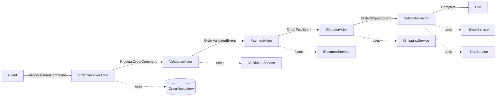

# 🏗️ Arquitetura do Sistema de Processamento de Pedidos

## 📐 Clean Architecture - Estrutura de Camadas

```
AkkaTest/
├── Domain/                      # 🟢 Camada de Domínio (Core Business Logic)
│   └── Entities/
│       └── Order.cs            # Entidade de domínio com regras de negócio
│
├── Application/                 # 🔵 Camada de Aplicação (Use Cases & Contracts)
│   ├── Interfaces/
│   │   └── IServices.cs        # Contratos de serviços (abstrações)
│   └── Messages/
│       └── OrderMessages.cs    # Value Objects (mensagens imutáveis)
│
├── Infrastructure/              # 🟡 Camada de Infraestrutura (Implementações)
│   ├── Persistence/
│   │   └── InMemoryOrderRepository.cs
│   └── Services/
│       └── ExternalServices.cs  # Implementações de serviços externos
│
├── Actors/                      # 🟣 Camada de Atores (Akka.NET)
│   ├── OrderReceiverActor.cs
│   ├── ValidationActor.cs
│   ├── PaymentActor.cs
│   ├── ShippingActor.cs
│   └── NotificationActor.cs
│
├── Configuration/               # ⚙️ Configuração e Factories
│   └── ActorSystemFactory.cs
│
└── Program.cs                   # 🎯 Entry Point (Composition Root)
```

---

## 🎯 Princípios SOLID Aplicados

### ✅ **S - Single Responsibility Principle**
Cada classe tem uma única responsabilidade:
- `OrderReceiverActor`: Apenas recebe e persiste pedidos
- `ValidationActor`: Apenas valida pedidos
- `PaymentActor`: Apenas processa pagamentos
- `ShippingActor`: Apenas processa envios
- `NotificationActor`: Apenas envia notificações

### ✅ **O - Open/Closed Principle**
Extensível através de interfaces:
- Novos gateways de pagamento podem ser adicionados implementando `IPaymentService`
- Novas transportadoras podem ser adicionadas implementando `IShippingService`
- Novas estratégias de validação implementando `IValidationService`

### ✅ **L - Liskov Substitution Principle**
Interfaces podem ser substituídas por qualquer implementação:
```csharp
IPaymentService paymentService = new StripePaymentService();
// Ou
IPaymentService paymentService = new PayPalPaymentService();
```

### ✅ **I - Interface Segregation Principle**
Interfaces específicas e focadas:
- `IEmailNotificationService`: Responsável apenas por email
- `ISmsNotificationService`: Responsável apenas por SMS
- Clientes não dependem de interfaces que não usam

### ✅ **D - Dependency Inversion Principle**
Todos os atores dependem de abstrações (interfaces), não de implementações concretas:
```csharp
public PaymentActor(IPaymentService paymentService, IActorRef nextActor)
    // Depende da abstração IPaymentService
```

---

## 🎨 Design Patterns (GoF) Implementados

### 1️⃣ **Factory Pattern**
`ActorSystemFactory` encapsula a criação do pipeline de atores:
```csharp
var actorFactory = new ActorSystemFactory(...);
var orderReceiver = actorFactory.CreateOrderProcessingPipeline();
```

### 2️⃣ **Repository Pattern**
`IOrderRepository` abstrai a persistência de dados:
```csharp
public interface IOrderRepository
{
    Task SaveAsync(Order order);
    Task<Order?> GetByIdAsync(int orderId);
}
```

### 3️⃣ **Strategy Pattern**
Permite trocar implementações em runtime:
- `IPaymentService`: Stripe, PayPal, Mercado Pago
- `IShippingService`: Correios, FedEx, DHL
- `IValidationService`: Diferentes regras de validação

### 4️⃣ **Chain of Responsibility Pattern**
O pipeline de atores implementa este padrão:
```
OrderReceiver → Validation → Payment → Shipping → Notification
```

### 5️⃣ **Dependency Injection Pattern**
Todas as dependências são injetadas via construtor:
```csharp
public OrderReceiverActor(IOrderRepository repository, IActorRef nextActor)
```

---

## 🔄 Fluxo de Dados (Pipeline)



---

## 📦 Dependências e Injeção

### Composition Root (Program.cs)
```csharp
// Instancia serviços (Infrastructure Layer)
IOrderRepository orderRepository = new InMemoryOrderRepository();
IValidationService validationService = new OrderValidationService();
IPaymentService paymentService = new PaymentGatewayService();
// ... outros serviços

// Cria factory com as dependências
var actorFactory = new ActorSystemFactory(
    actorSystem,
    orderRepository,
    validationService,
    paymentService,
    // ...
);

// Factory cria o pipeline
var orderReceiver = actorFactory.CreateOrderProcessingPipeline();
```

---

## 🧪 Testabilidade

A arquitetura permite testes unitários fáceis:

### Exemplo: Testando PaymentActor
```csharp
// Arrange
var mockPaymentService = new Mock<IPaymentService>();
var mockNextActor = TestActorRef.Create(...);

mockPaymentService
    .Setup(x => x.ProcessPaymentAsync(It.IsAny<int>(), It.IsAny<decimal>()))
    .ReturnsAsync("TXN-12345");

// Act
var paymentActor = TestActorRef.Create(
    () => new PaymentActor(mockPaymentService.Object, mockNextActor)
);

// Assert
mockPaymentService.Verify(x => x.ProcessPaymentAsync(1, 3500m), Times.Once);
```

---

## 🚀 Extensibilidade

### Adicionar Novo Gateway de Pagamento
```csharp
// 1. Implementar a interface
public class StripePaymentService : IPaymentService
{
    public async Task<string> ProcessPaymentAsync(int orderId, decimal amount)
    {
        // Integração com Stripe
        var result = await _stripeClient.Charges.CreateAsync(...);
        return result.Id;
    }
}

// 2. Registrar no Composition Root
IPaymentService paymentService = new StripePaymentService();
```

### Adicionar Nova Etapa no Pipeline
```csharp
// 1. Criar interface do serviço
public interface IFraudDetectionService
{
    Task<bool> CheckForFraudAsync(Order order);
}

// 2. Criar ator
public class FraudDetectionActor : ReceiveActor
{
    private readonly IFraudDetectionService _fraudService;
    private readonly IActorRef _nextActor;
    // ...
}

// 3. Adicionar na factory
var fraudActor = actorSystem.ActorOf(
    FraudDetectionActor.Create(_fraudService, validationActor)
);
```

---

## 📊 Vantagens da Arquitetura

### ✅ **Desacoplamento**
- Atores não conhecem implementações concretas
- Fácil substituir componentes

### ✅ **Testabilidade**
- Cada componente pode ser testado isoladamente
- Uso de mocks para interfaces

### ✅ **Manutenibilidade**
- Código organizado em camadas
- Responsabilidades bem definidas

### ✅ **Escalabilidade**
- Atores podem ser distribuídos
- Fácil adicionar instâncias paralelas

### ✅ **Flexibilidade**
- Troca de implementações sem alterar código dos atores
- Extensível através de interfaces

---

## 🔧 Próximos Passos (Melhorias Futuras)

1. **Adicionar Container de DI** (Microsoft.Extensions.DependencyInjection)
2. **Implementar Logging** (Serilog/NLog)
3. **Adicionar Retry Policies** (Polly)
4. **Implementar Circuit Breaker**
5. **Adicionar Métricas e Monitoring** (Prometheus/Grafana)
6. **Implementar Dead Letter Queue** para mensagens com falha
7. **Adicionar Persistência com Akka.Persistence**
8. **Implementar Health Checks**

---

## 📚 Referências

- **Clean Architecture**: Robert C. Martin (Uncle Bob)
- **SOLID Principles**: Robert C. Martin
- **Design Patterns**: Gang of Four (GoF)
- **Akka.NET Documentation**: https://getakka.net/
- **Domain-Driven Design**: Eric Evans
